 

 

  

  

 

## About

Student and software developer interested in how systems work and how to build them from scratch. My focus is on local AI, automation and intelligent agents, with game development as a long-running side interest. I enjoy solving programming problems and learning by building.

 

## Featured Projects

<table>
<tr>
<td width="33%" valign="top">

### VED
**Local AI assistant**

Offline assistant built on a local LLM that understands natural-language intent instead of fixed commands.

- Voice and text input
- Persistent memory and conversation recall
- Open/close apps, launch websites, system info
- Multi-action requests
- Customizable personality

`Python` `Ollama` `Speech Recognition` `Edge TTS` `Pygame`

</td>
<td width="33%" valign="top">

### Mutada
**2D metroidvania game**

Team project covering exploration, combat, level design and pixel-art direction.

`Godot` `GDScript` `Python`

</td>
<td width="33%" valign="top">

### Free-G
**Game-dev journey platform**

A personal space to share development updates, images, videos and discussions.

</td>
</tr>
</table>

 

## Tech Stack

 

## Currently Learning

Data Structures & Algorithms · Software Engineering · Agentic AI systems · System Design · Automation

 

## GitHub

 

## Get in Touch

Open to internships, collaborations and interesting problems. The best way to reach me is by [email](mailto:vanshkumarchandelofficial@gmail.com) or [LinkedIn](https://www.linkedin.com/in/vansh-kumar-b54352283).

 

